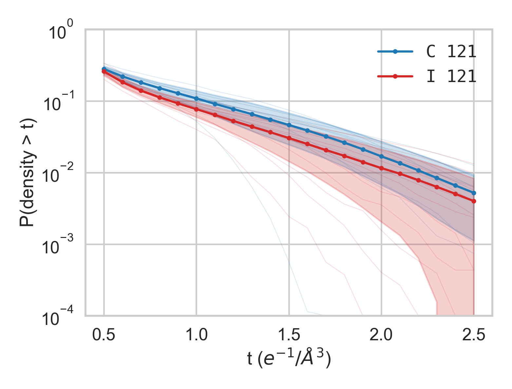
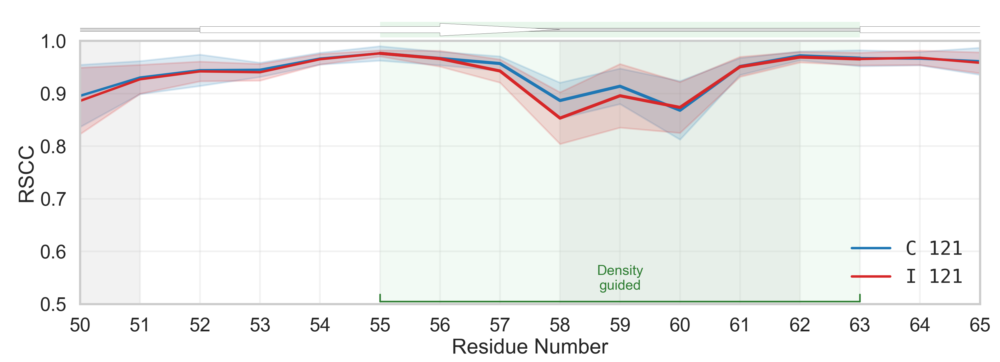
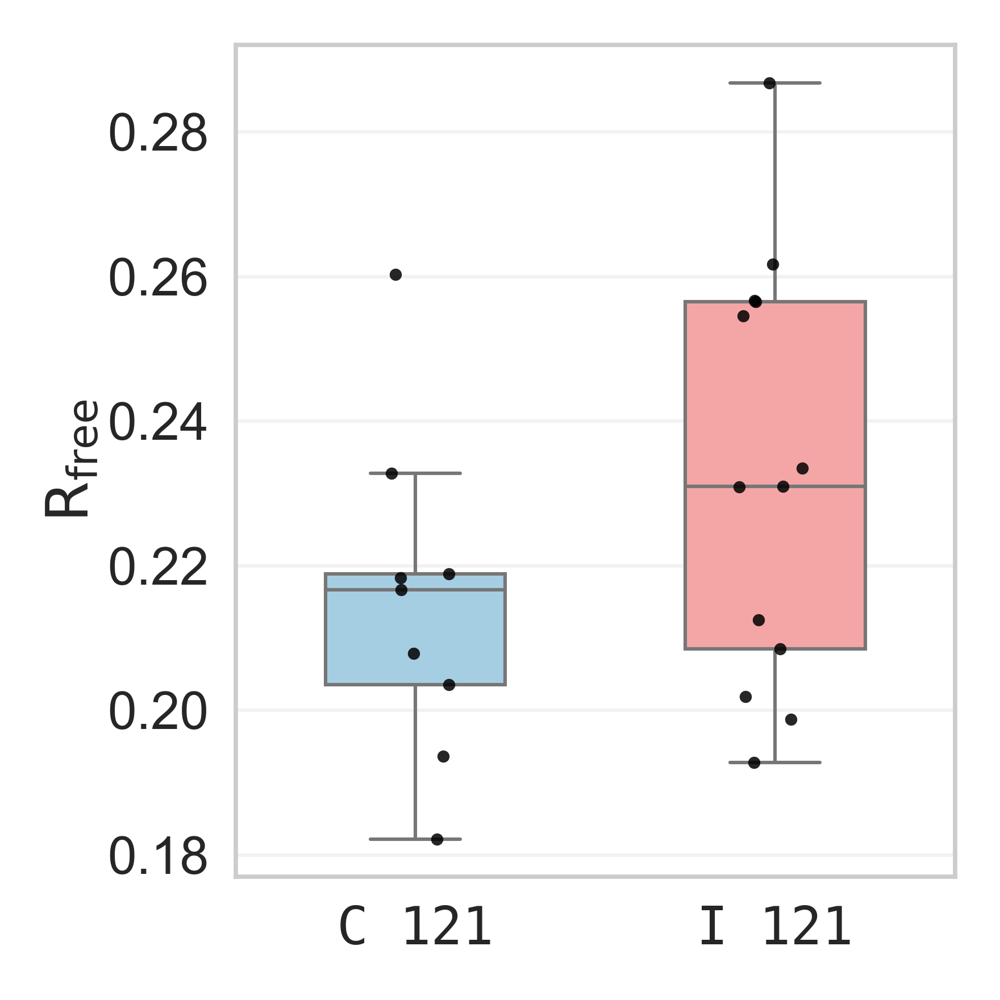
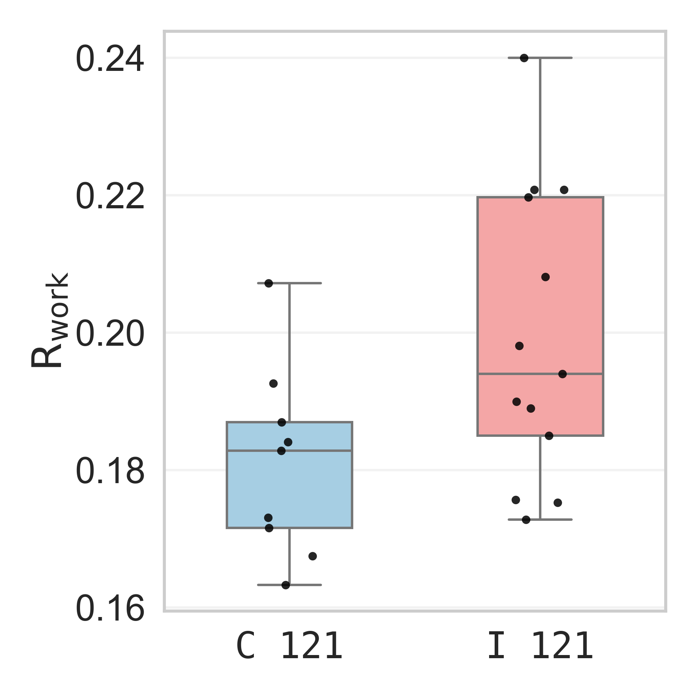
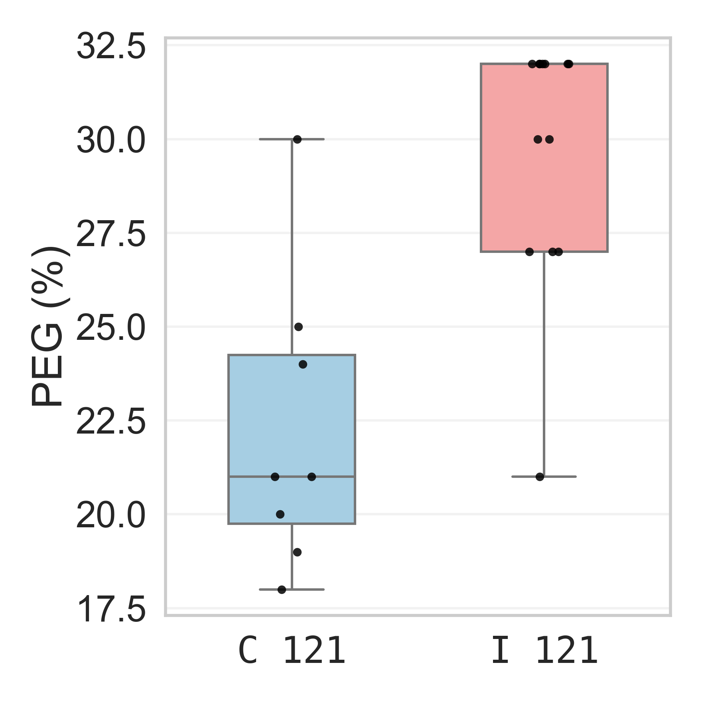
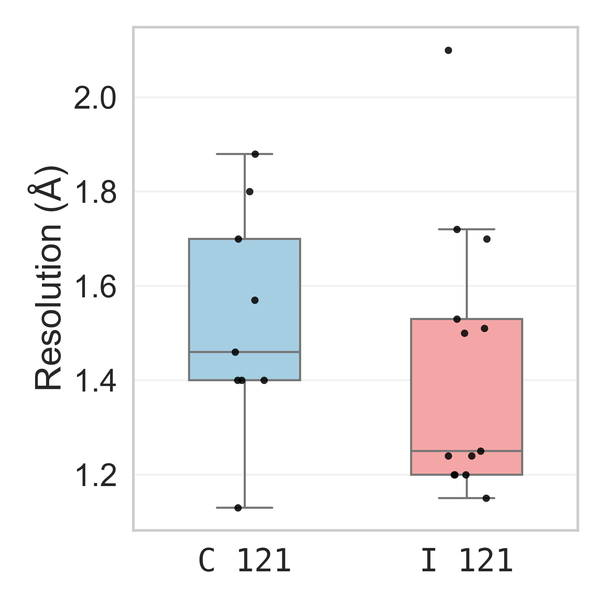

# Density-guided AlphaFold recovers unmodeled conformations in $\beta_2$-microglobulin"

This README is for reproducing results presented in the paper **"Density-guided AlphaFold3 uncovers unmodelled conformations in $\\{\beta}_2$-microglobulin"**.

All figures documented in this repository so far (this README + appendix) are for reproducing **Figure 2** in the paper.

This README is ordered by the primary figure narrative:
1. Density tail summary
2. RSCC with secondary-structure (SS) annotation
3. Box plots for R_free, R_work, PEG, and resolution

For all other figures, see [README_APPENDIX.md](README_APPENDIX.md).

Run commands from the repository root.

## Runtime Requirements
- Python 3.10+
- Python packages: `numpy`, `pandas`, `matplotlib`, `seaborn`, `gemmi`, `scipy`
- Extra package for SASA profiles: `freesasa`
- External binary for RSCC+SS plot: `mkdssp`

## 1) Density Tail Summary
Two-group density-tail comparison from carved CCP4 maps.

Reproduce:
```bash
python3 src/plot_density_tail_summary.py \
  data/maps/b2m_carved_fo/*_fo.ccp4 \
  --top-pdbs 1lds 2d4f 2yxf 3qda 4fxl 4rmu 4rmv 4rmw 6m1b \
  --bottom-pdbs 4rmr 4rms 4rmt 5cs7 5csb 5csg 7nmc 7nmo 7nmr 7nmt 7nmv 7nmy 7nn5 \
  --top-label "C 121" \
  --bottom-label "I 121" \
  --right-only \
  --right-log-y \
  --nonzero \
  --drop-lowest-percentile 0 \
  --x-min 0.5 \
  --x-max 2.5 \
  -o out/figures/density_tail_summary.png
```

Output:
- `out/figures/density_tail_summary.png`


## 2) RSCC + SS Annotation Plot
Per-residue RSCC with DSSP-derived secondary-structure cartoon annotation.

Reproduce:
```bash
python3 src/plot_rscc_dssp_cartoon.py \
  --pdb data/structures/4rmw_chain_A_altloc_A_fixed.pdb \
  --chain A
```

Output:
- `out/figures/rscc_dssp_cartoon.png`


## 3) Core Box Plots (R_free, R_work, PEG, Resolution)
These four box plots are produced by one command.

Reproduce:
```bash
python3 src/plot_resolution_boxplot.py
```

Outputs (ordered as requested):
- `out/figures/r_free_box.png`


- `out/figures/r_work_box.png`


- `out/figures/peg_box.png`


- `out/figures/resolution_box.png`


## Appendix
All other plots and reproduction commands are documented in:
- [README_APPENDIX.md](README_APPENDIX.md)
